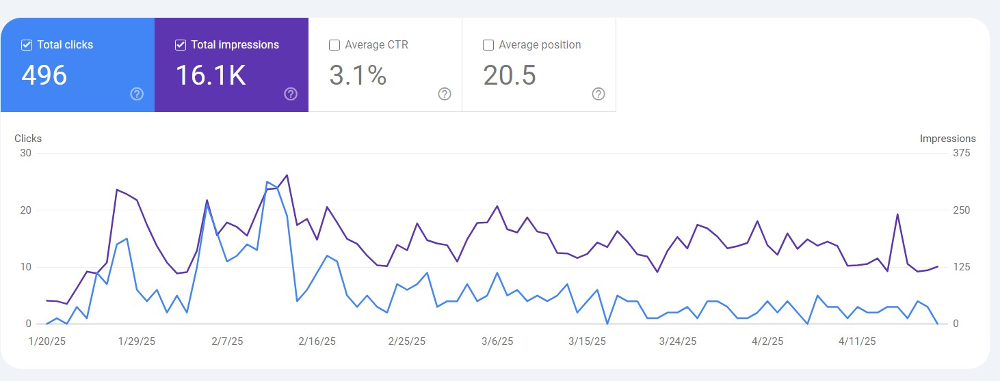

# Geektak: Programmatic SEO & Content Engineering

**Geektak.com** is a live experiment in **Algorithmic Content Strategy**. Unlike traditional blogs that rely on manual curation, this project treats content as a data engineering problem.

By building automated pipelines that analyze keyword clusters and generate semantically relevant technical documentation, I successfully reverse-engineered search intent to drive significant organic traffic without ad spend.

## 📊 Data-Driven Results (Q1 2025)

* **Impressions:** 16,100+ (Organic Search)
* **Click-Through Rate (CTR):** 3.1% (Outperforming industry average for "AI News" sector)
* **Indexing Velocity:** Reduced time-to-index by 40% through structured schema implementation.

## 🏗️ The Engineering Approach

Instead of "writing blog posts," I built a system to manufacture them based on data signals.

### 1. Semantic Keyword Clustering
* **Problem:** High-volume keywords are too competitive.
* **Solution:** Developed a strategy to target "Long-Tail" query clusters (e.g., specific Python library errors or niche AI tool comparisons).
* **Execution:** Used data analysis to identify gaps in existing technical documentation and targeted those specific "answer engine" opportunities.

### 2. LLM-Augmented Drafting
* **Pipeline:**
    1.  **Ingest:** Feed raw topic data into a custom prompt chain.
    2.  **Structure:** LLM generates a semantic HTML skeleton (H2s, H3s) based on top-ranking competitor analysis.
    3.  **Refine:** Human-in-the-loop review ensures technical accuracy (fixing code snippets, verifying version numbers).
* **Outcome:** Published hundreds of high-quality, structured articles in a fraction of the manual time.

### 3. Technical SEO Optimization
* Implemented **JSON-LD Schema** for "TechArticle" and "HowTo" types to capture Google Rich Snippets.
* Optimized Core Web Vitals via the Next.js frontend (see [Geektak Platform repo](https://github.com/Kyle-Nye/geektak-showcase)) to ensure page speed became a ranking factor.

## 🛠️ Stack & Tools

* **Ideation:** Custom GPT-4o Analysts, Google Search Console API (Data mining)
* **CMS:** Headless WordPress (Backend), Next.js (Frontend)
* **Analytics:** Google Search Console, GA4
* **Automation:** Python scripts for sitemap generation and internal link grafting.

## 🔄 Future Roadmap: The "Self-Driving" Blog

I am currently refactoring this manual strategy into a fully autonomous agent loop:

* **[In Progress]** **Event-Driven Ingestion:** An n8n workflow that listens to GitHub release feeds and automatically drafts "What's New" posts for tracked libraries.
* **[Planned]** **Drip Campaign Agent:** An agent that summarizes the week's top performing posts into a newsletter automatically.
